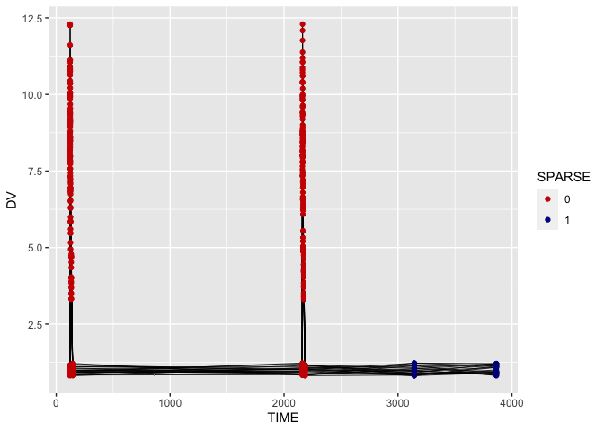
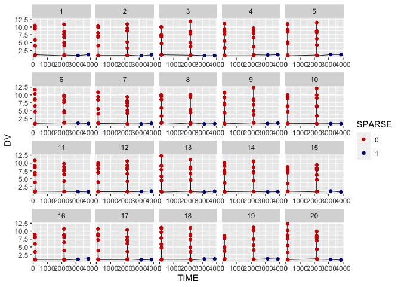

<!-- README.md is generated from README.Rmd. Please edit that file -->

# savictools

<!-- badges: start -->

[](https://github.com/saviclab/savictools/actions)
<!-- badges: end -->

## Overview

savictools is a collection of functions designed to make the
pharmacometrics workflow faster, simpler, and more intuitive.

##### Data preparation

-   `cohort()` generates simulation datasets for NONMEM.
-   `expwt()` computes expected weight for children under 5.
-   `sparse()` detects sparse vs. intensive PK sampling occasions.
-   `tad()` computes time after dose.
-   `zscores()` computes z-scores for WHO’s anthropometric indicators.

##### Visualization

-   `cr_plot()` visualizes the clinical relevance of covariates.
-   `etacorr_cat()` and `etacorr_cont()` plot ETA-covariate
    correlations.
-   `pk_plot()` creates PK concentration curves (“spaghetti plots”).
-   `VPC()` runs the Perl-speaks-Nonmem (PsN) `vpc` command from R, and
    is also a wrapper for xpose::VPC.

##### Workflow optimization

-   `param_table()` creates nicely formatted tables of parameter
    estimates for single or multiple models.
-   `parse_all_sse()` parses PsN `sse`-generated SSE_results.csv files
    and combines them into dataframes summarizing parameter statistics
    and error rates.

## Installation

To install the development version from GitHub:

``` r
# install.packages("devtools")
devtools::install_github("saviclab/savictools")
```

## Usage

``` r
library(savictools)
```

#### Data preparation

##### `cohort()` is used to generate NONMEM-ready datasets for clinical PK trials, either by sampling from real datasets or generating synthetic data.

``` r

pop_example
#> # A tibble: 1,000 × 5
#>        ID   SEX   AGE    WT    HT
#>     <dbl> <dbl> <dbl> <dbl> <dbl>
#>  1 308857     2    38  13.9  95  
#>  2  40640     1    45  15.6  99  
#>  3 416012     2    40  12.2  87.6
#>  4 102521     2     8   7.5  69  
#>  5 441236     2    50  11.6  91.5
#>  6 320895     2    43  14.4  96.7
#>  7 355954     2     1   3    48.4
#>  8  36653     1    30  11    78.5
#>  9  66799     1    36  12    86.2
#> 10   9352     1    20   8.9  78  
#> # … with 990 more rows

# 1. Sampling 20 individuals, above 10 kg and below 120 cm, with a fixed dose of
# 200 mg, observing every 4 hours for one day and dosing at times 0, 5, and 12.
# Note that the data has columns called "WT" and "HT".

inc <- "WT > 10 & HT < 120"
ot <- seq(0, 24, by = 4)
dt <- c(0, 5, 12)

cohort(
  pop_example,
  include = inc,
  n = 20,
  obs_times = ot,
  dose_times = dt,
  amt = 200
)
#> # A tibble: 200 × 9
#>       ID  TIME  EVID   AMT    DV   SEX   AGE    WT    HT
#>    <dbl> <dbl> <dbl> <dbl> <dbl> <dbl> <dbl> <dbl> <dbl>
#>  1 20707     0     1   200     0     2    33  11.6  91.1
#>  2 20707     0     0     0     0     2    33  11.6  91.1
#>  3 20707     4     0     0     0     2    33  11.6  91.1
#>  4 20707     5     1   200     0     2    33  11.6  91.1
#>  5 20707     8     0     0     0     2    33  11.6  91.1
#>  6 20707    12     1   200     0     2    33  11.6  91.1
#>  7 20707    12     0     0     0     2    33  11.6  91.1
#>  8 20707    16     0     0     0     2    33  11.6  91.1
#>  9 20707    20     0     0     0     2    33  11.6  91.1
#> 10 20707    24     0     0     0     2    33  11.6  91.1
#> # … with 190 more rows


# 2. Simulating data. We assume WT and HT are normally distributed random
# variables, with means and standard deviations of 16 and 3.4 for WT and 132
# and 13.6 for HT.

p1 <-
  list("WT" = list("rnorm", 16, 3.4),
       "HT" = list("rnorm", 132, 13.6))

cohort(
  param = p1,
  include = inc,
  n = 20,
  pop_size = 1000,
  obs_times = ot,
  dose_times = dt,
  amt = 200,
  original_id = FALSE
)
#> # A tibble: 200 × 7
#>       ID  TIME  EVID   AMT    DV    WT    HT
#>    <int> <dbl> <dbl> <dbl> <dbl> <dbl> <dbl>
#>  1     3     0     1   200     0  13.6  110.
#>  2     3     0     0     0     0  13.6  110.
#>  3     3     4     0     0     0  13.6  110.
#>  4     3     5     1   200     0  13.6  110.
#>  5     3     8     0     0     0  13.6  110.
#>  6     3    12     1   200     0  13.6  110.
#>  7     3    12     0     0     0  13.6  110.
#>  8     3    16     0     0     0  13.6  110.
#>  9     3    20     0     0     0  13.6  110.
#> 10     3    24     0     0     0  13.6  110.
#> # … with 190 more rows

# 3. As in (2), except we now define a dosing function.

dose_fun <- function(WT) {
  ifelse(WT < 16, 150,
         ifelse(WT < 20, 200, 250))
}

cohort(
  param = p1,
  include = inc,
  n = 20,
  pop_size = 500,
  obs_times = ot,
  dose_times = dt,
  original_id = FALSE,
  amt = dose_fun
)
#> # A tibble: 200 × 7
#>       ID  TIME  EVID   AMT    DV    WT    HT
#>    <int> <dbl> <dbl> <dbl> <dbl> <dbl> <dbl>
#>  1     2     0     1   150     0  12.6  111.
#>  2     2     0     0     0     0  12.6  111.
#>  3     2     4     0     0     0  12.6  111.
#>  4     2     5     1   150     0  12.6  111.
#>  5     2     8     0     0     0  12.6  111.
#>  6     2    12     1   150     0  12.6  111.
#>  7     2    12     0     0     0  12.6  111.
#>  8     2    16     0     0     0  12.6  111.
#>  9     2    20     0     0     0  12.6  111.
#> 10     2    24     0     0     0  12.6  111.
#> # … with 190 more rows
```

##### `expwt()` calculates expected weight based on age and sex in under-5 children, adding a column called EXPWT.

``` r
expwt(pop_example)
#> # A tibble: 1,000 × 6
#>        ID   SEX   AGE    WT    HT EXPWT
#>     <dbl> <dbl> <dbl> <dbl> <dbl> <dbl>
#>  1 308857     2    38  13.9  95    14.2
#>  2  40640     1    45  15.6  99    15.8
#>  3 416012     2    40  12.2  87.6  14.6
#>  4 102521     2     8   7.5  69     7.9
#>  5 441236     2    50  11.6  91.5  16.4
#>  6 320895     2    43  14.4  96.7  15.2
#>  7 355954     2     1   3    48.4   4.2
#>  8  36653     1    30  11    78.5  13.3
#>  9  66799     1    36  12    86.2  14.3
#> 10   9352     1    20   8.9  78    11.3
#> # … with 990 more rows
```

##### `sparse()` automatically detects sparse vs. intensive PK sampling in a dataset.

``` r
library(ggplot2)

pk_example
#> # A tibble: 489 × 7
#>       ID  TIME   AMT    DV  EVID  ADDL    II
#>    <dbl> <dbl> <dbl> <dbl> <dbl> <dbl> <dbl>
#>  1     1   0      25  0        1     0    12
#>  2     1  12      25  0        1     0     0
#>  3     1  24      25  0        1     0     0
#>  4     1  36      25  0        1     0     0
#>  5     1  48.0    25  0        1     0     0
#>  6     1  60.0    25  0        1     0     0
#>  7     1  71.7     0  1.31     0     0     0
#>  8     1  71.9    25  0        1     0     0
#>  9     1  72.9     0  2.60     0     0     0
#> 10     1  73.9     0  3.31     0     0     0
#> # … with 479 more rows

sparse(pk_example, plot = TRUE)
```



``` r

sparse(pk_example, plot = TRUE) + 
  facet_wrap("ID", scales = "free_x", )
```



##### `tad()` computes time after dose.

``` r
# Deleting and re-calculating TAD
tad(pk_example)
#> # A tibble: 489 × 8
#>       ID  TIME   AMT    DV  EVID  ADDL    II   TAD
#>    <dbl> <dbl> <dbl> <dbl> <dbl> <dbl> <dbl> <dbl>
#>  1     1   0      25  0        1     0    12   0  
#>  2     1  12      25  0        1     0     0   0  
#>  3     1  24      25  0        1     0     0   0  
#>  4     1  36      25  0        1     0     0   0  
#>  5     1  48.0    25  0        1     0     0   0  
#>  6     1  60.0    25  0        1     0     0   0  
#>  7     1  71.7     0  1.31     0     0     0  11.6
#>  8     1  71.9    25  0        1     0     0   0  
#>  9     1  72.9     0  2.60     0     0     0   1  
#> 10     1  73.9     0  3.31     0     0     0   2  
#> # … with 479 more rows
```

##### `zscores()` computes z-scores indicating nutritional status.

``` r
zscores(pop_example, units = "months")
#> # A tibble: 1,000 × 14
#>        ID   SEX   AGE    WT    HT   BMI   HAZ   WAZ   WHZ   BAZ HCZ   ACZ  
#>     <dbl> <dbl> <dbl> <dbl> <dbl> <dbl> <dbl> <dbl> <dbl> <dbl> <lgl> <lgl>
#>  1 308857     2    38  13.9  95    15.4 -0.37 -0.18  0.01  0.03 NA    NA   
#>  2  40640     1    45  15.6  99    15.9 -0.64 -0.13  0.41  0.42 NA    NA   
#>  3 416012     2    40  12.2  87.6  15.9 -2.55 -1.4   0.14  0.41 NA    NA   
#>  4 102521     2     8   7.5  69    15.8  0.1  -0.48 -0.66 -0.75 NA    NA   
#>  5 441236     2    50  11.6  91.5  13.9 -2.83 -2.63 -1.32 -1.06 NA    NA   
#>  6 320895     2    43  14.4  96.7  15.4 -0.73 -0.38  0.06  0.07 NA    NA   
#>  7 355954     2     1   3    48.4  12.8 -2.68 -2.33 -0.17 -1.3  NA    NA   
#>  8  36653     1    30  11    78.5  17.9 -3.94 -1.62  0.78  1.52 NA    NA   
#>  9  66799     1    36  12    86.2  16.1 -2.67 -1.48  0.03  0.44 NA    NA   
#> 10   9352     1    20   8.9  78    14.6 -2.21 -2.16 -1.53 -1.15 NA    NA   
#> # … with 990 more rows, and 2 more variables: TSZ <lgl>, SSZ <lgl>
```

#### Visualization
